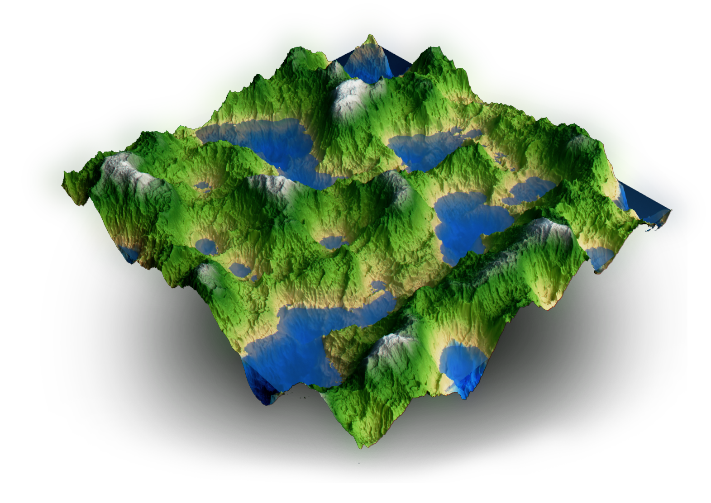
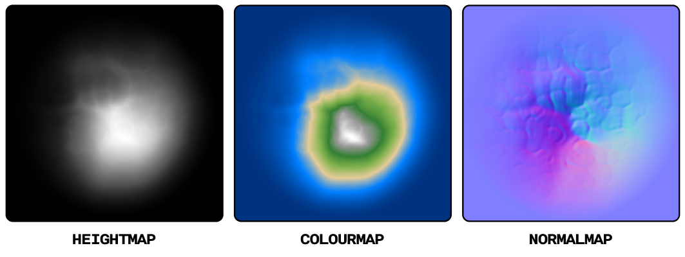
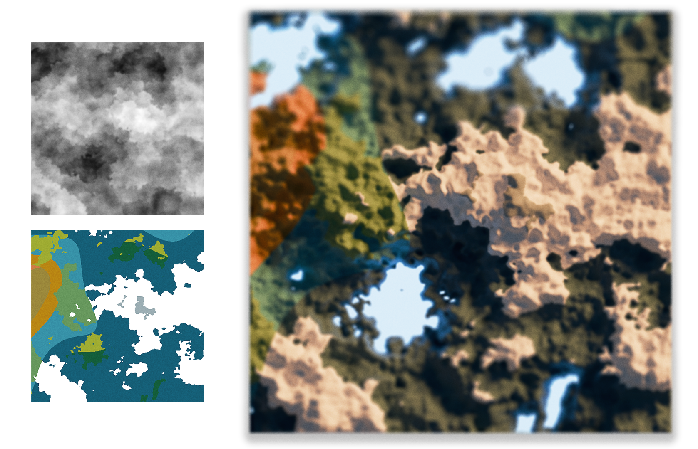
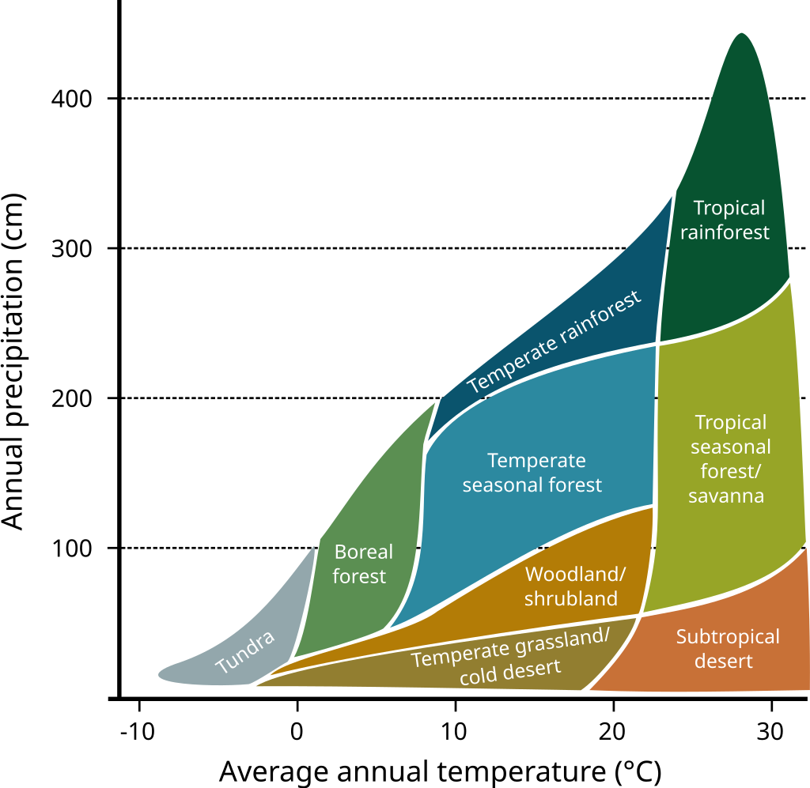
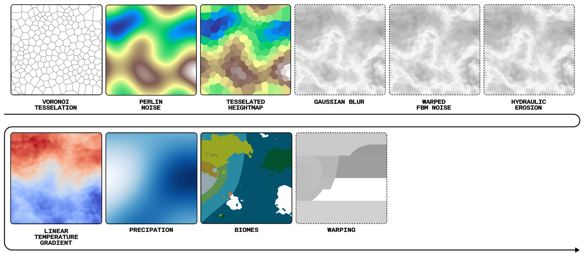

<div align="center">

**The tiny terrain generator.**
<picture>
  
</picture>
Maintained by [Quentin Wach](https://www.x.com/QuentinWach).
<h3>

[Examples](#examples) ▪ [Features](#features)
</h3>

[](https://opensource.org/licenses/MIT)
[](https://github.com/QuentinWach/terra/stargazers)
[](https://github.com/QuentinWach/terra/commits/main)
<!--[](https://discord.gg/ZjZadyC7PK)-->

**_Terra_ provides you with various physics simulations, tesselations, filters, presets, and more to generate realistic terrains.** (It's pretty bad right now but getting better!)

</div>

## Examples

**Example 1. Lakes and Mountains.** The heightmap and colormap were generated with _Terra_ using the code below then exported and rendered in Blender. Fractal Perlin noise is used to generate the terrain. In order to make the terrain more mountain-like, a custom pointify filter is applied on every level of the Perlin noise.
```python
X = 1000; Y = 1000
terrain = pointy_perlin(X, Y, scale=200, octaves=5, persistence=0.35, 
                        lacunarity=2.5, pointiness=0.5, pointilarity=0.5)
terrain_normal = normal_map(terrain)
export(terrain, 'terrain.png', cmap="Greys_r", dpi=300)
export(terrain, 'terrain_color.png', cmap=terrain_cmap(), dpi=300)
```



**Example 2. A Tiny Island.** Using fractal Perlin noise with the pointify effect at every level, a simple island can be generated effortlessly. The image here shows the heightmap, the colourmap, and normal map generated with _Terra_. 
```python
terrain = hill(500, 500) # create the island heightmap
normal_map = normal_map(terrain) # calculate the normals
export(terrain, "hill.png", cmap="Greys_r")
export(terrain, "hill_coloured.png", cmap=terrain_cmap())
export(normal_map, "hill_normal.png", cmap="viridis")
```

---
<!--


**Example 2. Map of a Continent with Various Biomes.** Tesselate the space using Voronoi cells. Create a heightmap using fractal Brownian noise. Create a temperature map using a slightly warped gradient with added Perlin noise, a precipation map created using Perlin noise. Classify the areas into biomes using a Whittaker diagram. Inspired by [Pvigier's Vagabond Map Generation](https://pvigier.github.io/2019/05/12/vagabond-map-generation.html). Rendered in [Blender](). 

```python
S = 42; X = 500; Y = 500
# Create the heightmap
tesselation = Voronoi(X, Y, density=0.001, relax=3, seed=S)
heightmap = perlin(X, Y, scale=150, octaves=1, seed=S)
heightmap = tess_heightmap(tesselation, shape=(X, Y), heightmap=heightmap)
heightmap = warp(heightmap, shape=(X, Y), warp_strength=20.0, seed=S+3)
heightmap = gaussian_blur(heightmap, sigma=2) + 0.5*perlin(X, Y, scale=50, octaves=4, seed=S+10)
# Create a linear temperature map and a precipitation map using Perlin noise
linear_tempmap = lingrad(X, Y, start=(X/2,0,30), end=(X/2,Y, -10))
temperaturemap = 30 - 25 * heightmap
precipationmap = 400 * perlin(X, Y, scale=500, octaves=2, seed=S+3)
# Create and save the biome map as a png file
biomemap = classify_biomes(temperaturemap, precipationmap)
plt.figure(figsize=(10, 10))
plt.imshow(biomemap, cmap=biome_cmap)
plt.axis('off') 
plt.savefig('biomemap.png', bbox_inches='tight', pad_inches=0, dpi=300)
plt.close()
# Export the heightmap as a png file
export(heightmap, 'heightmap.png', cmap='Greys_r', dpi=300)
```
-->
<!--
---
### 2. The Great Mountain
| |
| :--: |
| **Figure 2. The Great Mountain.** |

```python
from terra import *
np.random.seed(42)
WIDTH = 500; HEIGHT = 500

tesselate

```
---
### 3. River Networks
| |
| :--: |
| **Figure 3. River Networks.** |

```python
from terra import *
np.random.seed(42)
WIDTH = 500; HEIGHT = 500

tesselate

```
||
| :--: |
| **Climate Influence On Terrestrial Biome** by Navarras - Own work, CC0, https://commons.wikimedia.org/w/index.php?curid=61120531 |
-->

## Features
The [example shown above](#example) involved various steps. With very few functions, _Terra_ still offers a lot of flexibility in creating terrains. A typical workflow may look like this:



### Randomness `random`
+ [X] Normal Distribution
+ [X] Perlin Noise
+ [X] Billow Noise
+ [X] Fractal Perlin Noise
+ [X] Warping
+ [X] [Pointify](https://www.youtube.com/watch?v=gsJHzBTPG0Y)
+ [X] Pointy Perlin
### Tesselation `tess`
+ [X] Voronoi Tesselation
+ [X] Tesselation Relaxation with Fortune's Algorithm
+ [X] Tesselated Heightmap with Constant Elevation per Cell
+ [ ] Tesselated Heightmap with Linear Gradient per Cell
+ [ ] Fractal Tesselated Heightmap
+ [ ] Meshing to create 3D objects
### Rendering `render`
+ [X] Linear Gradient
+ [X] Whittaker Biome Classification and Colormap
+ [X] 2D Map Export (i.e. to generate a 3D file and render it in Blender)
+ [X] Radial Gradient
+ [X] Standard Terrain Heightmap
+ [ ] Normal Map Calculation
+ [ ] Terrace Filter (Creating Steps Given a Heightmap)
+ [ ] Masks
+ [ ] Gradient of Map
+ [ ] Divergence of Map
+ [ ] Materials (i.e. stone, sand, snow, water, grass, ...)
+ [ ] 2D Cartography Map Generator
+ [ ] Import (i.e. to import images to be used as height maps, filters, assets etc.)
+ [ ] Upscale / Super-Resolution (AI)
+ [ ] Smart texturing (AI)
### Simulation `sim`
+ [X] Wet Erosion: Eroding the local area to create stone-like effect from noise.
+ [ ] 👨🏻‍🔧 _**NEXT**_: [Hydraulic Terrain Erosion](https://www.youtube.com/watch?v=eaXk97ujbPQ)
+ [ ] [Fast Physically-Based Analytical Erosion](https://www.youtube.com/watch?v=zKnluMlRZNg)
+ [ ] [Diffusion Limited Aggregation (DLA):](https://www.youtube.com/watch?v=gsJHzBTPG0Y) Mountain Generation with Diffusion Lines
+ [ ] [Real-Time Erosion with Lake Generation](https://www.youtube.com/watch?v=Ds7R6UzMTXI) ([Paper](https://inria.hal.science/inria-00402079))
+ [ ] [Fast Hydraulic-Thermal Erosion On the GPU](https://old.cescg.org/CESCG-2011/papers/TUBudapest-Jako-Balazs.pdf)
+ [ ] Object Scattering (e.g. rocks)
+ [ ] River Networks
+ [ ] River Dynamics Simulation & Erosion
+ [ ] Snow Deposition
+ [ ] [Large Terrains with Tectonic Uplift and Fluvial Erosion](https://inria.hal.science/hal-01262376/document)
### Geo Primitives
+ [X] Hill
<!--
### Live View
+ [ ] Node editor like: 
  + https://github.com/IndiePython/nodezator ???
  + https://www.youtube.com/watch?v=xbTLhMJARrk&list=PLZSNHzwDCOggHLThIbCxUhWTgrKVemZkz ??
  + https://github.com/bhowiebkr/python-node-editor ??
  + https://www.youtube.com/watch?v=i_pB-Y0hCYQ
+ [ ] 2D Map Live view
+ [ ] 3D Render Window that updates live as the maps are updated

### Geo Primitives
+ [ ] Mountains
+ [ ] Crators
+ [ ] Rocks
+ [ ] Canions
+ [ ] Rivers
+ [ ] Lakes
+ [ ] Island
+ [ ] Sand
+ [ ] Slump
+ [ ] Dunes
+ [ ] Plates
-->
---
## Get Started
Clone the repository or download it as a zip. Create or open a local Python environment (I recommend Anaconda) and install the dependencies `dependencies.txt`. Go to the root directory and run `python -m examples.example_1` to test out the example given above or just explore the functions provided in the subdirectories to create various textures.

>[!Note]
> For now, _Terra_ only provides basic 2D rendering of the created maps and various effects and relies on Matplotlib for 3D rendering which is extremely slow. Export the maps you generate to Blender or any other 3D program of your choice then use displacement and color nodes etc. to create the landscapes.

---
## 🤝🏻 Contribute
**There is much to do.** The plan:
1. Implement various terrain generation algorithms and tools quickly in Python.
2. Once we have a capable collection, optimize the performance for real-time and large scales.
3. Create a GUI interface.

 At this point, Terra is pretty much just educational. But it doesn't have to be. Leave your mark and add to this Python library. You know how it goes. You found a bug? Add an issue. Any ideas for improvement or feeling the need to add more features? Clone the repository, make the changes, and submit a pull request, or...

> **Leave a ⭐ to show your support!**

[_MIT License_](LICENSE.txt)