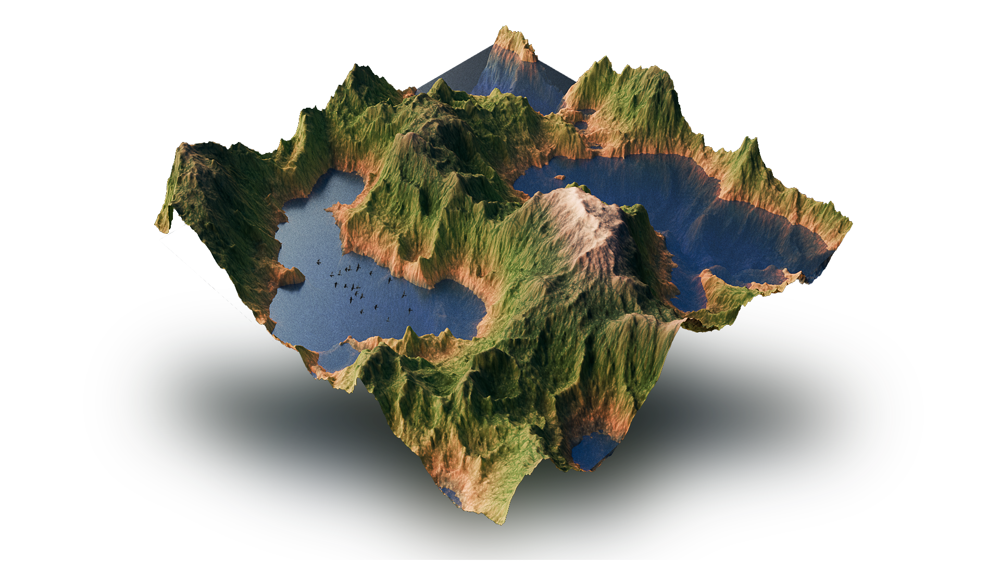

<div align="center">

**The tiny terrain generator.**
<picture>
  
</picture>
Maintained by [Quentin Wach](https://www.x.com/QuentinWach).
<h3>

[Examples](#examples) ▪ [Features](#features)
</h3>

[](https://opensource.org/licenses/MIT)
[](https://github.com/QuentinWach/terra/stargazers)
[](https://github.com/QuentinWach/terra/commits/main)
<!--[](https://discord.gg/ZjZadyC7PK)-->

**_Terra_ provides various physics simulations, geological primitives, tesselations, filters, and more to generate realistic terrains.** (It's pretty bad right now but getting better!)

</div>

## Examples

**Example 1. Eroded Mountains.** The heightmap and colormap were generated with _Terra_ using the code below then exported and rendered in Blender. Fractal Perlin noise is used to generate the terrain. In order to make the terrain more mountain-like, a custom pointify filter is applied on every level of the Perlin noise. Lastly, we simulate 20,000 particles for hydraulic erosion.
```python
heightmap = pointy_perlin(X=600, Y=600, scale=100)
eroded_heightmap, path_map = erode(heightmap, num_iterations=20000)
export(heightmap, 'terrain.png', cmap='Greys_r')
export(eroded_heightmap, 'erosion.png', cmap='Greys_r')
export(eroded_heightmap, "erosion_color.png", cmap=terrain_cmap())
export(np.log1p(path_map), 'path_map.png', cmap='Blues')
```
As you can see, it only takes two lines to create the terrain! Everything else is just exporting the various maps that are generated. Below is a more simpler example showing some of the maps:


**Example 2. A Tiny Island.** Using fractal Perlin noise with the pointify effect at every level, a simple island can be generated effortlessly. The image here shows the heightmap, the colourmap, and normal map generated with _Terra_. 
```python
island = hill(500, 500)
export(island, "hill.png", cmap="Greys_r")
export(island, "hill_coloured.png", cmap=terrain_cmap())
export(normal_map(island), "hill_normal.png", cmap="viridis")
```

---
<!--


**Example 2. Map of a Continent with Various Biomes.** Tesselate the space using Voronoi cells. Create a heightmap using fractal Brownian noise. Create a temperature map using a slightly warped gradient with added Perlin noise, a precipation map created using Perlin noise. Classify the areas into biomes using a Whittaker diagram. Inspired by [Pvigier's Vagabond Map Generation](https://pvigier.github.io/2019/05/12/vagabond-map-generation.html). Rendered in [Blender](). 

```python
S = 42; X = 500; Y = 500
# Create the heightmap
tesselation = Voronoi(X, Y, density=0.001, relax=3, seed=S)
heightmap = perlin(X, Y, scale=150, octaves=1, seed=S)
heightmap = tess_heightmap(tesselation, shape=(X, Y), heightmap=heightmap)
heightmap = warp(heightmap, shape=(X, Y), warp_strength=20.0, seed=S+3)
heightmap = gaussian_blur(heightmap, sigma=2) + 0.5*perlin(X, Y, scale=50, octaves=4, seed=S+10)
# Create a linear temperature map and a precipitation map using Perlin noise
linear_tempmap = lingrad(X, Y, start=(X/2,0,30), end=(X/2,Y, -10))
temperaturemap = 30 - 25 * heightmap
precipationmap = 400 * perlin(X, Y, scale=500, octaves=2, seed=S+3)
# Create and save the biome map as a png file
biomemap = classify_biomes(temperaturemap, precipationmap)
plt.figure(figsize=(10, 10))
plt.imshow(biomemap, cmap=biome_cmap)
plt.axis('off') 
plt.savefig('biomemap.png', bbox_inches='tight', pad_inches=0, dpi=300)
plt.close()
# Export the heightmap as a png file
export(heightmap, 'heightmap.png', cmap='Greys_r', dpi=300)
```
-->
<!--
---
### 2. The Great Mountain
| |
| :--: |
| **Figure 2. The Great Mountain.** |

```python
from terra import *
np.random.seed(42)
WIDTH = 500; HEIGHT = 500

tesselate

```
---
### 3. River Networks
| |
| :--: |
| **Figure 3. River Networks.** |

```python
from terra import *
np.random.seed(42)
WIDTH = 500; HEIGHT = 500

tesselate

```
||
| :--: |
| **Climate Influence On Terrestrial Biome** by Navarras - Own work, CC0, https://commons.wikimedia.org/w/index.php?curid=61120531 |
-->

## Features
The [example shown above](#example) involved various steps. With very few functions, _Terra_ still offers a lot of flexibility in creating terrains. 
<!--A typical workflow may look like this:

-->

### Randomness `random`
+ [X] Normal Distribution
+ [X] Perlin Noise
+ [X] Billow Noise
+ [X] Fractal Perlin Noise
+ [X] Warping
+ [X] [Pointify](https://www.youtube.com/watch?v=gsJHzBTPG0Y)
+ [X] Pointy Perlin
<!--
+ [ ] Texture Perlin: Uses Perlin Noise to Blend Between Textures (like different types of rocks)
  + https://polyhaven.com/textures/rock
  + https://www.sketchuptextureclub.com/textures/nature-elements/soil/mud
  + https://medialoot.com/blog/seamless-rock-textures/
-->
### Tesselation `tess`
+ [X] Voronoi Tesselation
+ [X] Tesselation Relaxation with Fortune's Algorithm
+ [X] Tesselated Height Map with Constant Elevation per Cell
### Rendering `render`
+ [X] Linear Gradient
+ [X] Whittaker Biome Classification and Color Map
+ [X] 2D Map Export (i.e. to generate a 3D file and render it in Blender)
+ [X] Radial Gradient / Mask
+ [X] Standard Terrain Height Map
+ [X] Normal Map Calculation
+ [X] Gradient of Map
+ [X] Divergence of Map
+ [X] Import (i.e. to import images to be used as height maps, filters, assets etc.)
+ [X] Gras Shader: Grow Gras Only on Flat, Low Areas
+ [X] Snow Deposition
+ [ ] High-Res Exports for maps for better rendering and re-use

<!--
+ [ ] Advanced Terrain Color Map
+ [ ] Terrace Filter (Creating Steps Given a Height Map)
+ [ ] Materials (i.e. stone, sand, snow, water, grass, ...)
+ [ ] 2D Cartography Map Generator
+ [ ] Project Map(s) to a 3D Globe 
+ [ ] Upscale / Super-Resolution (AI)
+ [ ] Smart texturing (AI)
-->
### Simulation `sim`
<!-- Talk about types of terrains: https://www.youtube.com/watch?v=G83dkjtnjlw -->
<!-- Talk about drainage patterns: https://www.youtube.com/watch?v=Xpmy0YLMvo4 -->
+ [X] [Hydraulic Single-Particle Terrain Erosion](https://www.youtube.com/watch?v=eaXk97ujbPQ)
  + [ ] Optimized Erosion Rain Pattern: Rain Only Over Mountain Peaks to Speed Up the Erosion Effect
+ [ ] 🔨 _NEXT:_ [Fast Physically-Based Analytical Erosion](https://www.youtube.com/watch?v=zKnluMlRZNg)
  + [X] First version
  + [ ] Improve the rain pattern
  + [ ] Improve the flux/motion of the water
  + [ ] Improve evaporation
  + [ ] Fix the common hole-digging error with an add. heuristic
+ [ ] 🔨 _NEXT:_ [Fractal Pixel Mountain Generation](https://www.youtube.com/watch?v=gsJHzBTPG0Y)

<!--
+ [ ] [Diffusion Limited Aggregation (DLA):](https://www.youtube.com/watch?v=gsJHzBTPG0Y) Mountain Generation with Diffusion Lines
+ [ ] [Interactive Terrain Modeling Using Hydraulic Erosion](https://cgg.mff.cuni.cz/~jaroslav/papers/2008-sca-erosim/2008-sca-erosiom-fin.pdf)
+ [ ] [Real-Time Erosion with Lake Generation](https://www.youtube.com/watch?v=Ds7R6UzMTXI) ([Paper](https://inria.hal.science/inria-00402079))
+ [ ] [Fast Hydraulic-Thermal Erosion On the GPU](https://old.cescg.org/CESCG-2011/papers/TUBudapest-Jako-Balazs.pdf)
+ [ ] [Wind Erosion](https://nickmcd.me/2022/10/01/procedural-wind-and-clouds-using-gpu-accelerated-lattice-boltzmann-method/)
+ [ ] [Multiple Soil Layer Simulations](https://github.com/weigert/SoilMachine)
+ [ ] [Procedural Weather Patterns](https://nickmcd.me/2018/07/10/procedural-weather-patterns/)
+ [ ] [Clustered Convection for Plate Tectonics](https://nickmcd.me/2020/12/03/clustered-convection-for-simulating-plate-tectonics/)
+ [ ] 2D Fluid Simulation Constrained by the Height Map
+ [ ] 3D Fluid Simulation with Actual 3D Terrain
+ [ ] Object Scattering (e.g. rocks)
+ [ ] River Networks
+ [ ] River Dynamics Simulation & Erosion
+ [ ] [Large Terrains with Tectonic Uplift and Fluvial Erosion](https://inria.hal.science/hal-01262376/document)
+ [ ] [Simple Tectonics](https://www.youtube.com/watch?v=GjaZ7GIIl54) ([Helpful Intro](https://www.youtube.com/watch?v=x_Tn66PvTn4))
-->

### Geo Primitives
+ [X] Hill
+ [ ] 🔨 _NEXT:_ Mountains
+ [ ] 🔨 _NEXT:_ Dunes

### Manual Edit
+ [ ] Add and subtract by drawing on any map

<!--
+ [ ] Craters
+ [ ] Lakes
+ [ ] Slump
+ [ ] Plates
-->
<!--
### Live View
+ [ ] Simple GUI
+ [ ] Show the Maps
+ [ ] Show the 3D Terrain
+ [ ] Zoom
+ [ ] Pan
+ [ ] Rotate
+ [ ] Snap Back
+ [ ] Node editor like: 
  + https://github.com/IndiePython/nodezator ???
  + https://www.youtube.com/watch?v=xbTLhMJARrk&list=PLZSNHzwDCOggHLThIbCxUhWTgrKVemZkz ??
  + https://github.com/bhowiebkr/python-node-editor ??
  + https://www.youtube.com/watch?v=i_pB-Y0hCYQ
-->
<!--
+ [ ] Planetary Cloud/Weather Simulation
+ [ ] Globe Light Scattering and Diffraction like S. Lague 
-->

---
## Other Links
+ [World Building Pasta](https://worldbuildingpasta.blogspot.com/). A phenomenal and in-depth blog about everything that shapes planets, their terrain, and how to create new worlds yourself.

---
## Get Started
Clone the repository or download it as a zip. Create or open a local Python environment (I recommend Anaconda) and install the dependencies `dependencies.txt`.

---
## 🤝🏻 Contribute
**There is much to do.** The plan:
1. Implement various terrain generation algorithms and tools quickly in Python.
2. Optimize the performance for real-time and large scales by improving the algorithms, using C, and the GPU.
3. Create a GUI interface.

 At this point, Terra is pretty much just educational. But it doesn't have to be. Leave your mark and add to this Python library. You know how it goes. You found a bug? Add an issue. Any ideas for improvement or feeling the need to add more features? Clone the repository, make the changes, and submit a pull request, or...

> **Leave a ⭐ to show your support!**

[_MIT License_](LICENSE.txt)