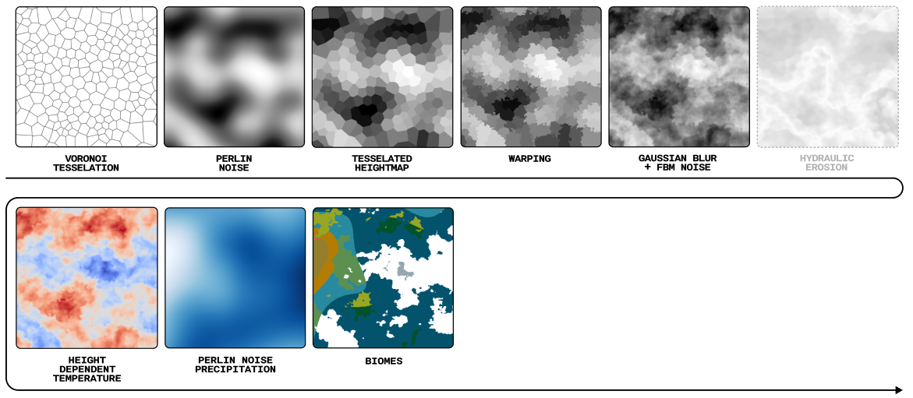

<div align="center">

**The tiny terrain generator.**
<picture>
  
</picture>
Maintained by [Quentin Wach](https://www.x.com/QuentinWach).
<h3>

[Example](#example) ▪ [Features](#features)
</h3>

[](https://opensource.org/licenses/MIT)
[](https://github.com/QuentinWach/terra/stargazers)
[](https://github.com/QuentinWach/terra/commits/main)
<!--[](https://discord.gg/ZjZadyC7PK)-->

**_Terra_ provides you with various physics simulations, tesselations, filters, presets, and more to generate realistic terrains.** (It's pretty bad right now but getting better!)

</div>

<!--
Get started with:
```
pip install terra
```-->
## Example


**Example 1. Map of a Continent with Various Biomes.** Tesselate the space using Voronoi cells. Create a heightmap using fractal Brownian noise. Create a temperature map using a slightly warped gradient with added Perlin noise, a precipation map created using Perlin noise. Classify the areas into biomes using a Whittaker diagram. Inspired by [Pvigier's Vagabond Map Generation](https://pvigier.github.io/2019/05/12/vagabond-map-generation.html). Rendered in [Blender](). 

```python
from terra.tess import Voronoi
from terra.random import perlin, warp
from terra.render import gaussian_blur, lingrad, export, tess_heightmap, classify_biomes, biome_cmap
import matplotlib.pyplot as plt
# Set random seed S and the height X and width Y of the map
S = 42; X = 500; Y = 500
# Create the heightman
tesselation = Voronoi(X, Y, density=0.001, relax=3, seed=S)
heightmap = perlin(X, Y, scale=150, octaves=1, seed=S)
heightmap = tess_heightmap(tesselation, shape=(X, Y), heightmap=heightmap)
heightmap = warp(heightmap, shape=(X, Y), warp_strength=20.0, seed=S+3)
heightmap = gaussian_blur(heightmap, sigma=2) + 0.5*perlin(X, Y, scale=50, octaves=4, seed=S+10)
# Create a linear temperature map and a precipitation map using Perlin noise
linear_tempmap = lingrad(X, Y, start=(X/2,0,30), end=(X/2,Y, -10))
temperaturemap = 30 - 25 * heightmap
precipationmap = 400 * perlin(X, Y, scale=500, octaves=2, seed=S+3)
# Create the biome map
biomemap = classify_biomes(temperaturemap, precipationmap)
# Save the biome map
plt.figure(figsize=(10, 10))
plt.imshow(biomemap, cmap=biome_cmap)
plt.axis('off') 
plt.savefig('biomemap.png', bbox_inches='tight', pad_inches=0, dpi=300)
plt.close()
# Export the heightmap as a png file
export(heightmap, 'heightmap.png', cmap='Greys_r', dpi=300)
```

<!--
---
### 2. The Great Mountain
| |
| :--: |
| **Figure 2. The Great Mountain.** |

```python
from terra import *
np.random.seed(42)
WIDTH = 500; HEIGHT = 500

tesselate

```
---
### 3. River Networks
| |
| :--: |
| **Figure 3. River Networks.** |

```python
from terra import *
np.random.seed(42)
WIDTH = 500; HEIGHT = 500

tesselate

```
||
| :--: |
| **Climate Influence On Terrestrial Biome** by Navarras - Own work, CC0, https://commons.wikimedia.org/w/index.php?curid=61120531 |
-->

## Features
The [example shown above](#example) involved various steps. With very few functions, _Terra_ still offers a lot of flexibility in creating terrains. A typical workflow may look like this:



### Randomness `random`
+ [X] Normal Distribution
+ [X] Perlin Noise
+ [X] Fractal Perlin Noise
+ [X] Warping
### Tesselation `tess`
+ [X] Voronoi Tesselation
+ [X] Tesselation Relaxation with Fortune's Algorithm
+ [X] Tesselated Heightmap with Constant Elevation per Cell
+ [ ] Tesselated Heightmap with Linear Gradient per Cell
+ [ ] Fractal Tesselated Heightmap
+ [ ] Meshing to create 3D objects
### Rendering `render`
+ [X] Linear Gradient
+ [X] Whittaker Biome Classification
+ [X] Colormaps
+ [X] 2D Map Export (i.e. to generate a 3D file and render it in Blender)
+ [ ] Radial Gradient
+ [ ] Masks
+ [ ] Gradient of Map
+ [ ] Divergence of Map
+ [ ] Materials (i.e. stone, sand, snow, water, grass, ...)
+ [ ] 2D Cartography Map Generator
+ [ ] Import (i.e. to import images to be used as height maps, filters, assets etc.)
+ [ ] Upscale / Super-Resolution (AI)
+ [ ] Smart texturing (AI)
### Simulation `sim`
+ [X] Stone Levels
+ [X] Brownian Mountains
+ [ ] 👨🏻‍🔧 _**NEXT**_: Hydraulic Terrain Erosion
+ [ ] Object Scattering (e.g. rocks)
+ [ ] River Networks
+ [ ] River Dynamics Simulation & Erosion
+ [ ] Snow Deposition

<!--
### 2D/3D Assets `assets`
+ [ ] Crators
+ [ ] Mountains
+ [ ] Rocks
+ [ ] Canions
+ [ ] Rivers
+ [ ] Lakes
-->

---
## 🤝🏻 Contribute
**There is much to do!** At this point, Terra is pretty much just educational. But it doesn't have to be. Leave your mark and add to this Python library! You know how it goes. You found a bug? Add an issue. Any ideas for improvement or feeling the need to add more features? Clone the repository, make the changes, and submit a pull request, or...

> **Leave a ⭐ to show your support!**

[_MIT License_](LICENSE.txt)